# Invyra.ai – Multi-Tenant Database Architecture & Schema

This document details the PostgreSQL schema and multi-tenant security architecture powering **Invyra.ai**. The database is hosted on **Supabase** (PostgreSQL) with strictly enforced **Row Level Security (RLS)** and tenant ownership boundaries, with transparent fallback to local persistent storage for zero-dependency development.

---

## 1. Entity Relationship (ER) Diagram

```mermaid
erDiagram
    users ||--o{ businesses : "owns"
    businesses ||--o{ workflows : "configures"
    businesses ||--o{ customer_conversations : "receives"
    businesses ||--o{ calendar_events : "schedules"
    workflows ||--o{ customer_conversations : "executes"
    customer_conversations ||--o{ calendar_events : "initiates"

    users {
        TEXT id PK "u-timestamp-random"
        TEXT email UK "Unique owner email"
        TEXT owner_name "Full legal or practice name"
        TEXT password_hash "scrypt-64k derived hash"
        TEXT salt "32-byte cryptographic salt"
        TEXT reset_token "Recovery token (cleared upon use)"
        BIGINT reset_token_expiry "Epoch timestamp"
        TIMESTAMPTZ created_at "Default NOW()"
        TIMESTAMPTZ updated_at "Default NOW()"
    }

    businesses {
        TEXT id PK "b-timestamp-random"
        TEXT owner_user_id FK "References users(id) ON DELETE CASCADE"
        TEXT name "Practice or company trade name"
        TEXT industry "Clinic, Bakery, Logistics, etc."
        TEXT owner_name "Owner point of contact"
        TEXT email "Business notifications email"
        TEXT phone "Inbound missed-call number"
        TEXT business_address "Physical practice address"
        TEXT preferred_language "Default: English & Hindi"
        TEXT timezone "Default: America/New_York"
        TEXT operating_hours "Clinic opening and consultation hours"
        TEXT tone "AI persona instructions"
        BOOLEAN google_calendar_connected "Live Google Calendar sync flag"
        TIMESTAMPTZ created_at "Default NOW()"
        TIMESTAMPTZ updated_at "Default NOW()"
    }

    workflows {
        TEXT id PK "wf-timestamp-random"
        TEXT business_id FK "References businesses(id) ON DELETE CASCADE"
        TEXT name "Workflow title"
        TEXT trigger "Default: missed_call"
        TEXT greeting "Opening speech prompt"
        JSONB fields_schema "Array of fields to collect"
        JSONB urgency_rules "Array of conditional rules"
        JSONB conditional_rules "Array of branch conditions"
        TEXT action_after_collection "create_calendar_event, etc."
        TEXT closing_message "Spoken goodbye message"
        BOOLEAN is_active "Toggle workflow execution"
        TIMESTAMPTZ created_at "Default NOW()"
        TIMESTAMPTZ updated_at "Default NOW()"
    }

    customer_conversations {
        TEXT id PK "conv-timestamp-random"
        TEXT business_id FK "References businesses(id) ON DELETE CASCADE"
        TEXT workflow_id FK "References workflows(id) ON DELETE SET NULL"
        TEXT caller_name "Caller full name"
        TEXT caller_phone "Caller E.164 phone number"
        TEXT status "completed | in_progress | failed | cancelled"
        TEXT intent "Classified customer goal"
        JSONB collected_data "Extracted parameter values"
        TEXT summary "LLM clinical/business summary"
        TEXT action_performed "Tool call result description"
        TEXT priority "normal | high | urgent"
        TEXT follow_up_status "pending | contacted | completed | closed"
        JSONB transcript "Full turn-by-turn dialogue array"
        TEXT language "en | hi | bilingual"
        TIMESTAMPTZ created_at "Default NOW()"
        TIMESTAMPTZ updated_at "Default NOW()"
    }

    calendar_events {
        TEXT id PK "cal-timestamp-random"
        TEXT business_id FK "References businesses(id) ON DELETE CASCADE"
        TEXT conversation_id FK "References customer_conversations(id) ON DELETE SET NULL"
        TEXT title "Event title"
        TIMESTAMPTZ start_time "Appointment ISO start"
        TIMESTAMPTZ end_time "Appointment ISO end"
        TEXT attendee_name "Patient / customer name"
        TEXT attendee_phone "Patient contact phone"
        TEXT doctor_or_service "Physician or service name"
        TEXT notes "Clinical notes / symptoms / visit reason"
        TEXT google_event_id "Google Calendar Event ID"
        TEXT status "confirmed | rescheduled | cancelled"
        TIMESTAMPTZ created_at "Default NOW()"
        TIMESTAMPTZ updated_at "Default NOW()"
    }
```



---

## 2. Table Schemas & Constraints

### 2.1 `users`
Stores registered practice owners and operators.
* **`id`** (`TEXT`, Primary Key): Prefixed tenant ID format `u-${timestamp}-${random}`.
* **`email`** (`TEXT`, Unique, Not Null): Lowercase normalized email.
* **`owner_name`** (`TEXT`, Not Null): Display name (e.g., *Dr. Aryan Sharma*).
* **`password_hash`** (`TEXT`, Not Null): Derived using Node.js `crypto.scryptSync(password, salt, 64, { N: 16384, r: 8, p: 1 })`.
* **`salt`** (`TEXT`, Not Null): 32-byte cryptographic random hex string.
* **`reset_token`** (`TEXT`, Nullable): Secure 32-byte recovery token.
* **`reset_token_expiry`** (`BIGINT`, Nullable): Epoch expiry timestamp (1-hour window).
* **`created_at`** / **`updated_at`** (`TIMESTAMPTZ`): Timestamp tracking.

### 2.2 `businesses`
Represents an individual practice, clinic, or business entity.
* **`id`** (`TEXT`, Primary Key): Format `b-${timestamp}-${random}`.
* **`owner_user_id`** (`TEXT`, Foreign Key &rarr; `users.id`, Cascade Delete): Identifies the owning tenant.
* **`name`** (`TEXT`, Not Null): Business trade name (e.g., *Apex Care Multi-Specialty Clinic*).
* **`industry`** (`TEXT`, Not Null): Business sector (e.g., *Clinic & Healthcare*, *Bakery & Cake Shop*).
* **`phone`** (`TEXT`, Not Null): Official contact phone number.
* **`business_address`** (`TEXT`, Nullable): Physical clinic or studio address.
* **`preferred_language`** (`TEXT`, Default `English & Hindi`): Spoken dialect preference.
* **`timezone`** (`TEXT`, Default `America/New_York`): IANA timezone for appointment slots.
* **`operating_hours`** (`TEXT`): Business schedule (e.g., *Mon-Sat: 8:30 AM - 7:00 PM*).
* **`tone`** (`TEXT`): Assistant behavioral guidelines.
* **`google_calendar_connected`** (`BOOLEAN`, Default `false`): Google Calendar integration status.

### 2.3 `workflows`
Configurable conversational workflows tailored to specific business requirements.
* **`id`** (`TEXT`, Primary Key): Format `wf-${timestamp}-${random}`.
* **`business_id`** (`TEXT`, Foreign Key &rarr; `businesses.id`, Cascade Delete): Scoped to owning business.
* **`name`** (`TEXT`, Not Null): Workflow title.
* **`trigger`** (`TEXT`, Default `missed_call`): Trigger event.
* **`greeting`** (`TEXT`, Not Null): Initial spoken prompt.
* **`fields_schema`** (`JSONB`, Default `[]`): Array of data fields to extract (`key`, `label`, `type`, `required`, `promptQuestion`).
* **`urgency_rules`** (`JSONB`, Default `[]`): Condition rules flagging acute caller priorities.
* **`conditional_rules`** (`JSONB`, Default `[]`): Branching rules based on caller responses.
* **`action_after_collection`** (`TEXT`, Default `create_calendar_event`): Automated completion action.
* **`closing_message`** (`TEXT`): Spoken sign-off statement.
* **`is_active`** (`BOOLEAN`, Default `true`): Operational flag.

### 2.4 `customer_conversations`
Stores historical records of all inbound/outbound missed-call interactions.
* **`id`** (`TEXT`, Primary Key): Format `conv-${timestamp}-${random}`.
* **`business_id`** (`TEXT`, Foreign Key &rarr; `businesses.id`, Cascade Delete): Tenant isolation boundary.
* **`workflow_id`** (`TEXT`, Foreign Key &rarr; `workflows.id`, Nullable): Associated workflow.
* **`caller_name`** (`TEXT`, Not Null): Caller name.
* **`caller_phone`** (`TEXT`, Not Null): Caller contact number.
* **`status`** (`TEXT`, Default `completed`): `in_progress` | `completed` | `failed` | `cancelled`.
* **`intent`** (`TEXT`): LLM-classified customer intent.
* **`collected_data`** (`JSONB`): Structured extracted parameters.
* **`summary`** (`TEXT`): Generated interaction synopsis.
* **`action_performed`** (`TEXT`): Summary of tool or database action taken.
* **`priority`** (`TEXT`, Default `normal`): `normal` | `high` | `urgent`.
* **`follow_up_status`** (`TEXT`, Default `pending`): `pending` | `contacted` | `completed` | `closed`.
* **`transcript`** (`JSONB`): Array of turn-by-turn utterances (`role`, `message`, `timestamp`, `tool_call`).
* **`language`** (`TEXT`, Default `en`): Detected caller language (`en` | `hi` | `bilingual`).

### 2.5 `calendar_events`
Appointments and callbacks synchronized with Google Calendar and the local schedule.
* **`id`** (`TEXT`, Primary Key): Format `cal-${timestamp}-${random}`.
* **`business_id`** (`TEXT`, Foreign Key &rarr; `businesses.id`, Cascade Delete): Tenant isolation boundary.
* **`conversation_id`** (`TEXT`, Foreign Key &rarr; `customer_conversations.id`, Nullable): Originating call.
* **`title`** (`TEXT`, Not Null): Appointment title (e.g., *Cardiology Consultation - Priya Sharma*).
* **`start_time`** / **`end_time`** (`TIMESTAMPTZ`, Not Null): ISO 8601 appointment range.
* **`attendee_name`** / **`attendee_phone`** (`TEXT`, Not Null): Patient contact parameters.
* **`doctor_or_service`** (`TEXT`): Assigned physician or department.
* **`notes`** (`TEXT`): Clinical intake details.
* **`google_event_id`** (`TEXT`): Remote Google Calendar ID for live updates and deletions.
* **`status`** (`TEXT`, Default `confirmed`): `confirmed` | `rescheduled` | `cancelled`.

---

## 3. Row Level Security (RLS) & Isolation Policies

All tables have Row Level Security enabled (`ALTER TABLE ... ENABLE ROW LEVEL SECURITY`).

1. **`users` Policy**:
```sql
CREATE POLICY "Users can only access their own user record"
    ON users FOR ALL
    USING (auth.uid()::text = id)
    WITH CHECK (auth.uid()::text = id);
```

2. **`businesses` Policies**:
```sql
CREATE POLICY "Owners can view their own businesses"
    ON businesses FOR SELECT
    USING (owner_user_id = auth.uid()::text);

CREATE POLICY "Owners can manage their own businesses"
    ON businesses FOR ALL
    USING (owner_user_id = auth.uid()::text)
    WITH CHECK (owner_user_id = auth.uid()::text);
```

3. **Subordinate Table (`workflows`, `customer_conversations`, `calendar_events`) Policies**:
```sql
CREATE POLICY "Owners can access tenant workflows"
    ON workflows FOR ALL
    USING (business_id IN (SELECT id FROM businesses WHERE owner_user_id = auth.uid()::text))
    WITH CHECK (business_id IN (SELECT id FROM businesses WHERE owner_user_id = auth.uid()::text));

CREATE POLICY "Owners can access tenant customer conversations"
    ON customer_conversations FOR ALL
    USING (business_id IN (SELECT id FROM businesses WHERE owner_user_id = auth.uid()::text))
    WITH CHECK (business_id IN (SELECT id FROM businesses WHERE owner_user_id = auth.uid()::text));

CREATE POLICY "Owners can access tenant calendar events"
    ON calendar_events FOR ALL
    USING (business_id IN (SELECT id FROM businesses WHERE owner_user_id = auth.uid()::text))
    WITH CHECK (business_id IN (SELECT id FROM businesses WHERE owner_user_id = auth.uid()::text));
```

---

## 4. Query Performance Indexes

```sql
CREATE INDEX idx_users_email ON users(email);
CREATE INDEX idx_businesses_owner ON businesses(owner_user_id);
CREATE INDEX idx_workflows_business ON workflows(business_id);
CREATE INDEX idx_conversations_business ON customer_conversations(business_id);
CREATE INDEX idx_conversations_created_at ON customer_conversations(created_at DESC);
CREATE INDEX idx_conversations_follow_up ON customer_conversations(follow_up_status);
CREATE INDEX idx_conversations_priority ON customer_conversations(priority);
CREATE INDEX idx_calendar_business ON calendar_events(business_id);
CREATE INDEX idx_calendar_start_time ON calendar_events(start_time ASC);
```
